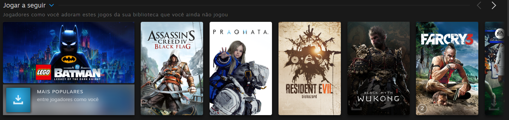
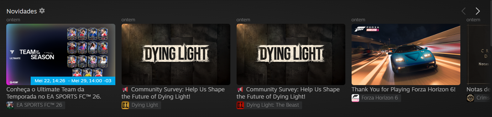

# Tools What's New

Millennium plugin que adiciona novidades publicas da Steam de jogos lua no carrossel "What's New" da pagina inicial da biblioteca.

Ele le AppIDs dos manifestos locais dos jogos lua, prioriza jogos jogados ou adicionados recentemente para o feed de novidades, busca novidades publicas via `ISteamNews/GetNewsForApp`, resolve os IDs nativos dos eventos da Steam e mistura esses eventos no proprio carregador da pagina inicial da biblioteca.

No "Play Next" nativo da biblioteca, ele usa a estrategia `balanced-play-next-v2`: jogos lua nunca jogados ou esquecidos ha muito tempo ganham prioridade, titulos jogados nas ultimas duas semanas perdem peso, jogos lua adicionados recentemente recebem um pequeno bonus e as recomendacoes sao diversificadas para uma mesma serie ocupar menos espaco da linha.

O backend so busca URLs de noticias/imagens da Steam, e o frontend so abre URLs da Steam. Caminhos locais e timestamps de tempo de jogo sao usados internamente para ranking, mas nao sao retornados ao frontend.

## Exemplos

